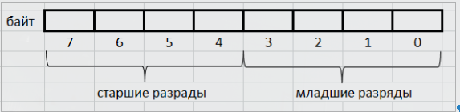
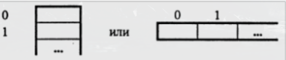
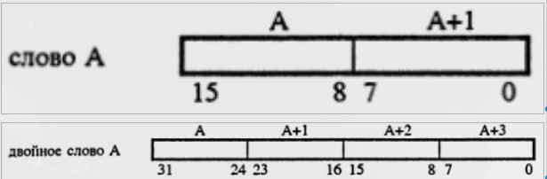
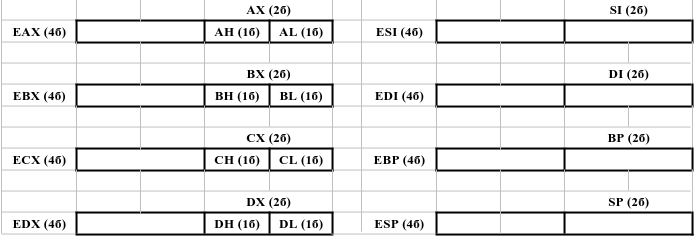

# Особенности ПК

Рассматриваются ПК, созданные на базе микропроцессоров семейства 80x86 Intel (8086, 80286, 80386). К ним относятся ПК фирмы IBM и совместимые с ними. Для процессоров 80x86 соблюдается преемственность: программа, написанная для более ранних моделей, могут без изменений выполняться на поздних. Обеспечивается это за счёт того, что в основе всех процессоров лежит система команд процессора 8086, а в последующей модели лишь добавляются новые команды.

## Оперативная память

Оперативная память делится на ячейки размером в 8 разрядов (байты, byte), в каждом разряде может быть записано 0 или 1 (бит, bit).

19 = 00010011b = 13h

73 = 1001001b = 49h

Байты нумеруются начиная с нуля, порядковый номер байта называется его адресом.

Если объём оперативной памяти $2^20$ байтов, то для ссылок на байты памяти нужны 20-разрядные адреса

0000 0000 0000 0000 0000
1111 1111 1111 1111 1111

От 00000h до FFFFFh

32-разрядные адреса

От 00000000h до FFFFFFFFh

Байт - наименьшая адресуемая ячейка памяти, можно адресовать слово (2 соседних байта, word) и двойное слово (double word, 4 соседних байта).

Адрес слова и двойного слова - адрес его первого байта (с наименьшим адресом)

## Регистры

Регистры - ячейки памяти внутри процессора.

Существуют несколько видов регистров.

### Регистры общего назначения

Регистры общего назначения можно использовать в любых машинных операциях. Кроме того, каждый регистр имеет специализацию.

A - accumulator, аккумулятор \
B - base, база \
C - counter, счётчик \
D - data, данные \
SI - source index, индекс источника \
DI - destination index, индекс приёмника \
BP - base pointer, указатель базы \
SP - stack pointer, указатель стека \
L - low, младший \
H - high, старший \
X - eXtended, расширенный \
E - extra, дополнительный

Возможен независимое применение различных частей регистров.

### Сегментные регистры

Память разделена на участки (сегменты). Сегментные регистры содержат адреса ячеек памяти, с которых начинаются соответствующие сегменты.

CS - code segment (сегмент команд, содержит код программы) \
DS - data segment (сегмент данных, содержит данные программы) \
SS - stack segment (сегмент стека, область памяти, работа с которым организована по принципу последний зашёл, первый вышел) \
ES - extra segment (дополнительный) \

В сегментные регистры можно считывать и записывать с ограничениями, они не могут участвовать в арифметических и логических операциях.