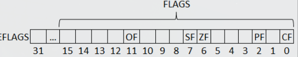
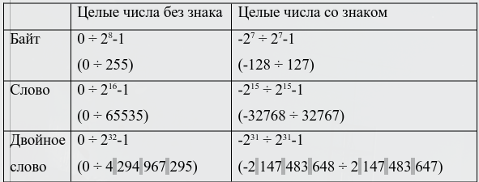

## Регистры (продолжение)

Указатель команды содержит адрес следующей команды.

Называется IP (instruction pointer).

### Регистр флагов

Флаг - бит, принимающий значение 1 (флаг установлен), если выполнено некоторое условие, и 0 (флаг сброшен) в противном случае.

Флаги объединены в регистр флагов.

CF (carry flag) - флаг переноса \
ZF (zero flag) - флаг нуля \
SF (sign flag) - флаг знака \
OF (overflow flag) - флаг переполнения \
PF (parity flag) - флаг чётности

### Пользовательские регистры

ST0, ST1, ..., ST7 \
MMX0, MMX1, ..., MMX7 \
XMM0, XMM1, ..., XMM7

### Системные регистры

СR0, CR1, ..., CR4 \
GDTR, IDTR, LDTR, TR \
MTRR \
MSR

## Представление данных

### Целые числа

Целые числа представляются байтом, словом или двойным словом. Различаются целые числа без знака (неотрицательные) и со знаком.

Беззнаковые числа занимают все разряды ячейки.

98 (байт) = 0110 0010b = 62h
98 (слово) = 0000 0000 0110 0010b = 0062h
98 (двойное слово) = 0000 0062h

Знаковые числа записываются в дополнительном коде.

Дополнительный код (x) = $x, если x\ge{0}$,\
$2^k - |x|,\spaceесли\space x\le{0}$