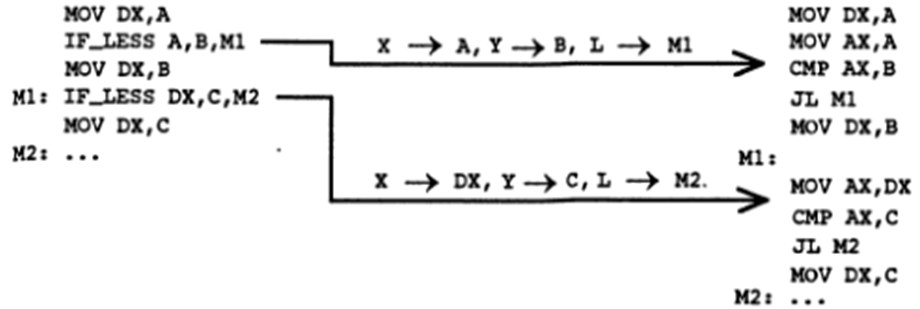

# Макросы

Если некоторый фрагмент программы должен повторяться в разных местах, то используются макросы: специальным образом описывается этот фрагмент и в нужных местах программы выписывается ссылка на него.

Когда макрогенератор встречает в тексте программы ссылку, то вместо неё подставляет сам фрагмент.

Описание макроса - макроопределение, ссылка на макрос - макрокомандой, процесс замены макрокоманды на макрос - макроподстановка, а результат такой подстановки - макрорасширение.

## Описание макроса

```x86asm
имя MACRO формальные параметры через запятую; заголовок
тело макроса; любое число любых предложений
ENDM
```

Имена формальных параметров локализуются в теле макроса, поэтому могут быть любыми.

```x86asm
SUM MACRO X, Y ;X:=X+Y
MOV AX, Y
ADD X, AX
ENDM
```

Макроопределения могут размещаться в любом месте программы, но до первой ссылки на этот макрос.

Обращение к макросу

```x86asm
имя фактические параметры через запятую
SUM A, B
```

Фактический параметр - любой текст, в том числе и пустой, который должен быть сбалансирован по кавычкам и угловым скобкам, не должен содержать запятую, точку с запятой, пробел вне кавычек и угловых скобок.

Число фактических параметров должно равняться числу формальных параметров, причём i-тый фактический параметр соответствует i-тому формальному.

Если макрогенератор в тексте программы встречает макрокоманду, то он выполняет макроподстановку: находит описание соответствующего макроса, в его теле заменяет формальные параметры на фактические, и полученный текст вставляет вместо макрокоманды.

```x86asm
SUM A, B

-> X->A, Y->B

MOV AX, B
ADD A, AX
```

Примеры:

1. Описание крупных операций в виде макросов

Один из недостатков ЯА - применение при программировании мелких операций. В определённой мере этот недостаток можно устранить с помощью макросов - более крупные операции описываются в виде макросов, а затем составляют программу с использованием этих макросов.

```x86asm
; DX = min(A,B,C)

IF_LESS MACRO X, Y, L
MOV AX, X
CMP AX, Y
JL L
ENDM
```



Если макрокоманда помечена меткой, то в макрорасширении эта метка размещается в отдельной строке, а тело макроса начинается со следующей строки, так как первая команда макроса может быть помечена своей меткой.

2. Макросы и обращения к процедурам

При обращении к процедуре приходится выписывать одну и ту же группу команд, которую можно описать как макрос.

Пусть есть процедура, вычисляющая НОД двух чисел.

Z=NOD(X,Y), X передается через АХ, Y – через ВХ, а Z возвращается через АХ

CX=NOD(A,B)+NOD(C,D)

```x86asm
MOV АХ, А
MOV ВХ, В
CALL NOD
MOV СХ, АХ
MOV АХ, С
MOV BX, D
CALL NOD
ADD CX, AX
```

```x86asm
NOD_CALL MACRO X, Y
MOV AX, X
MOV BX, Y
CALL NOD
ENDM
```

```x86asm
NOD_CALL A, B
mov cx, ax
NOD_CALL C, D
add cx, ax
```

p = 2 * a1 * a2 * a3

```x86asm
a1 db ...
a2 db ...
a3 db ...
p db ?
mov al, 2
mul a1
mul a2
mul a3
mov p, al
```

```x86asm
multiply macro a
mul a
endm

A1 DB ...
A2 DB ...
A3 DB...
P DW....
MOV AL, 2
multiply a2
multiply a3
multiply a1
MOV P, AX

A1 DB ...
A2 DB ...
A3 DB...
P DW....
MOV AL, 2
IRP A, <A1, A2, A3>
multiply A
ENDM
MOV P, AX
```
