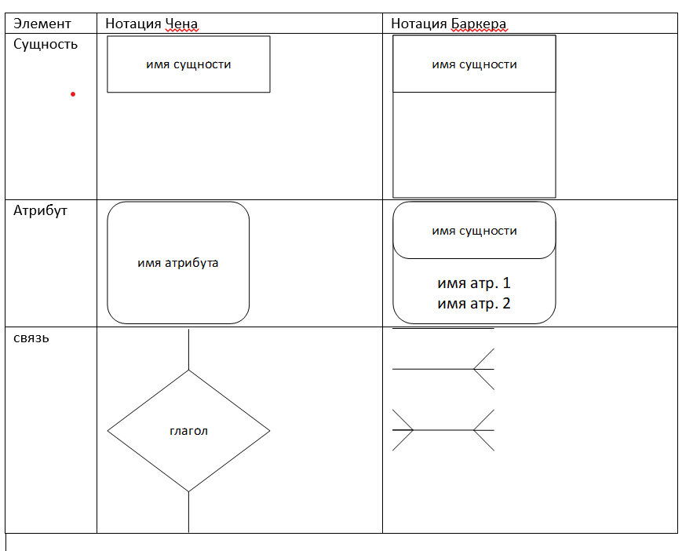

- связь - это отношение сущности к другой или к самой себе

Связь многие ко многим является временным типом связи, допустимым на ранних этапах разработки модели. В дальнейшем такую связь необходимо заменить двумя связями типа один ко многим путём выделения промежуточной сущности. Независимая сущность представляет независимые данные, которые всегда присутствуют в системе. Они могут быть как связаны с другими сущностями, так и нет.

Зависимая сущность - представляет собой данные, зависящие от другой сущности системы, поэтому она должна быть всегда связана с другими сущностями.

Если экземпляр сущности полностью идентифицируется своими ключевыми атрибутами, то говорят о полной идентификации сущности.

Итоговая концептуальная схема должна быть проверена с точки зрения возможности получения всех выходных данных, показанных на диаграмме потоков данных разрабатываемой системы.

Понятие объект и свойство являются относительными, что в каждом из моделей ПрО следует считать самостоятельным объект а что свойством другого объекта будет зависеть от аспекта рассмотрения данной ПрО.

В качестве самостоятельного объекта ER-модели следует изображать сущности:

- для которых фиксируются какие-то свойства
- которые участвуют в более чем одной связи

При возникновении сомнений лучше принять решение о создании самостоятельного объекта, так как это в дальнейшем потребует меньше переделок модели.
