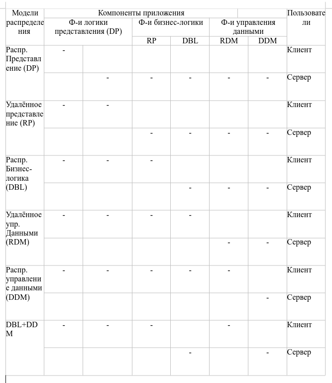

## Основные достоинства языка SQL

1. Стандартность
2. Независимость от конкретной СУБД
3. Возможность перенсоа с одной вычислительной системы на другую
4. Реляционная основа языка
5. Возможность создания интерактивных запросов
6. Возможность программного доступа к БД
7. Обеспечение различного представления данных
8. Возможность динамического изменения и расширения структуры БД
9. Поддержка архитектуры клиент-сервер

## Основные понятия архитектуры удалённых БД (УБД)

Система управления УБД - это СУБД, обеспечивающее возможность одновременного доступа к информации различных пользователей. 

Архитектура БД - организация связей аппаратных средств

Существуют следующие архитектуры БД:

- клиент-сервер
- многоуровневая архитектура клиент-сервер
- файл-сервер

Архитектура ODBC (Open DataBase Connectivity) - открытый интерфейс доступа к БД

Пользователь БД - программа или человек, обращающийся к БД

Запрос - процесс обращения пользователя к БД с целью ввести, получить или изменить информацию.

# Архитектура клинет-сервер. Технология управления УБД

Клиент-сервер применяется в архитектуре ПО состоящая из двух процессов обработки информации: клиентского процесса и серверного. ПРи этом предполагалось, что один серверный процесс может обслужить множество клиентских процессов.

Основной принцип модели клиент-сервер заключается в разделении функции стандартного интерактивного приложения на 5 групп, имеющих различия предела:

1. Функции ввода и отображения данных (Presentation Logic)
2. Прикладные функции, определяющие основные алгоритмы решения задач приложения (Business Logic)
3. Функция обработки данных внутри приложения (DataBase Logic)
4. Функция, управления информационными ресурсами (DataBase Manager System)
5. Служебные функции, играющие роль связок между функциями первыъ четырёх групп.

Структура типового приложения, работающего с БД в архитектуре клиент-сервер приведена на следующем рисунке:

Клиентская часть приложения включает в себя следующие части:

- презентационная логика - часть приложения, определяемая тем, что пользователь видит на своём экране, что приложение работает. Основные задачи презентационной логики:

  - формирование правильных изображений
  - чтение и запись в экранной форме информации
  - управление экраном
  - обработка движений мыши и нажатий клавиатуры

- бизнес-логика - часть кода приложения, которая определяет алгоритм решения конкретных его задач
- логика обработки данных - часть кода приложения, которая непосредственно связана с обработкой данных внутри него. Данными управляет СУБД, а для обеспечения доступа к ним используется язык SQL. Это СУБД, которое обеспечивает хранение и управление БД. В централизованной архитектуре указанные части приложения располагаются в единой среде и комбинируется в одной исполняемой программы. В децентрализованной архитектуре эти части приложения могут быть по разному распеределены между клиентом и сервером.

В зависимости от характера распределения задач можно выделить следующие модели:

- распределённое представление (Distribution Presentation)
- удалённое представление (Remote Presentation)
- распределённая бизнес логика (Distribution Business Logic)
- удалённое управление данными (Remote Data Management)
- распределённое управление данными (Distributed Data Management)

В этой таблице приведены возможные распределения функций в модели клиент-сервер

