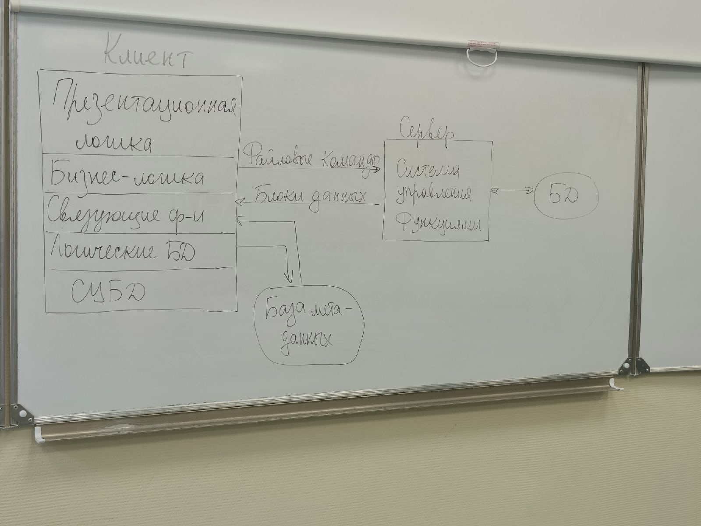
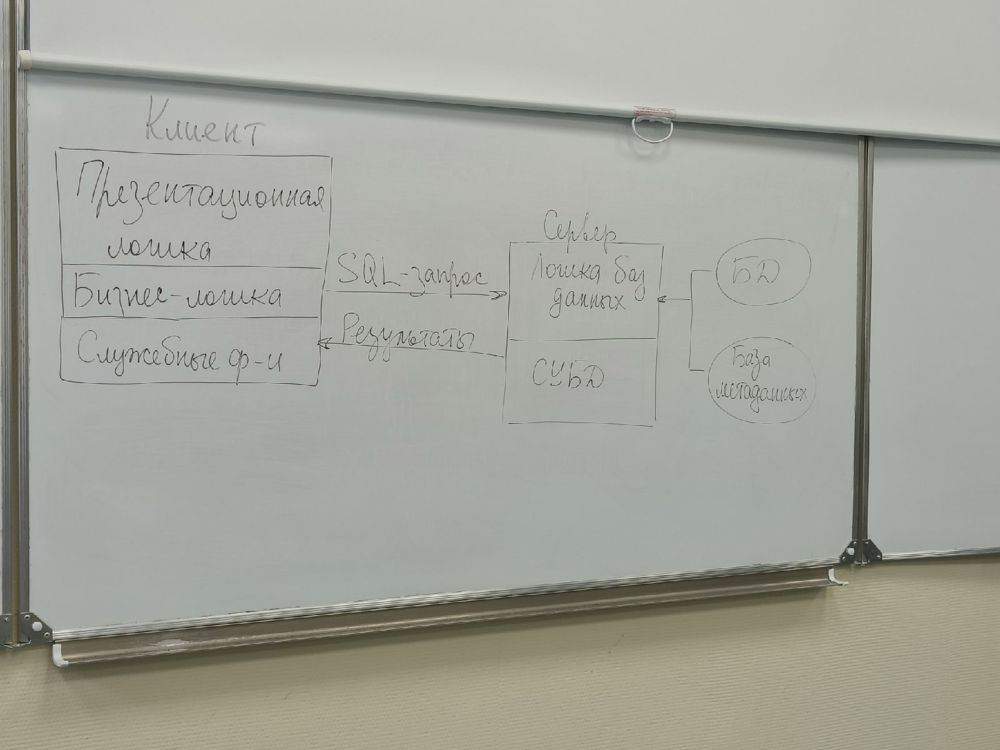

# Двухуровневые модели управления БД

Двухуровневые модели управления БД являются результатом распределения пяти указанных ранее групп функции стандартного интерактивного приложения между двумя процессами. 

На сервере располагаются файлы

Функции управления информационными ресурсами находятся на клиентской части.

Файлы хранятся на сервере. Клиент обращается к серверу с файловыми командами, а механизм управления всеми информационными ресурсами - собственно база метаданных, находится на компьютере клиента. Алгоритм выполнение клиентского запроса сводится к следующему:

1. Запрос формулируется на языке
2. СУБД переводит этот запрос в последовательность файловых команд
3. Каждая файловая команда вызывает перекачку блока информации на компьютер клиента, СУБД анализирует полученную информацию, и если в полученном блоке не содержится ответа на запрос, то принимается решение о перекачке следующего блока информации
4. Перекачка информации происходит до тех пор

Недостатки модели клиент-сервер:

- высокий трафик, который связан с передачей по сети множество блоков файлов, необходимых приложению манипулирования с данными, определяемый только файловыми командами
- отсутствие адекватных средств безопасности доступа к данным (защита только на уровне файловой системы)

# Модель удалённого доступа к данным (RDA)

В этой модели хранится ядро СУБД. На компьютере клиента оказывается презентационная и бизнес-логика приложения. Клиент обращается к серверу с помощью языка SQL.

Преимущества данной модели:

1. перенос компонента представления и прикладного компонента разгружает компьютер сводя к минимуму общее число выполняемых процессов в ОС
2. сервер БД освобождается от несвойственных ему функций, процессор полностью загружаются операции обработки данных, запросов и транзакций
3. резко уменьшается загрузка сети, т.к. клиенты передают SQL запросы, а в ответ на SQL запрос пользователь получает необходимую информацию

Недостатки

1. Запросы на языке SQL при интенсивной работе могут существенно нагрузить сеть
2. т.к. в этой модели на компьютере клиента располагается презентационная и бизнес-логика приложения при повторении аналогичных функций других приложений код соответствующий бизнес-логики должен быть повторён для каждого клиентского приложения что вызывает излишнее дублирование
3. т.к. сервер в этой модели играет пассивную роль функцию управления информационными ресурсами должны выполняться на компьютере клиента