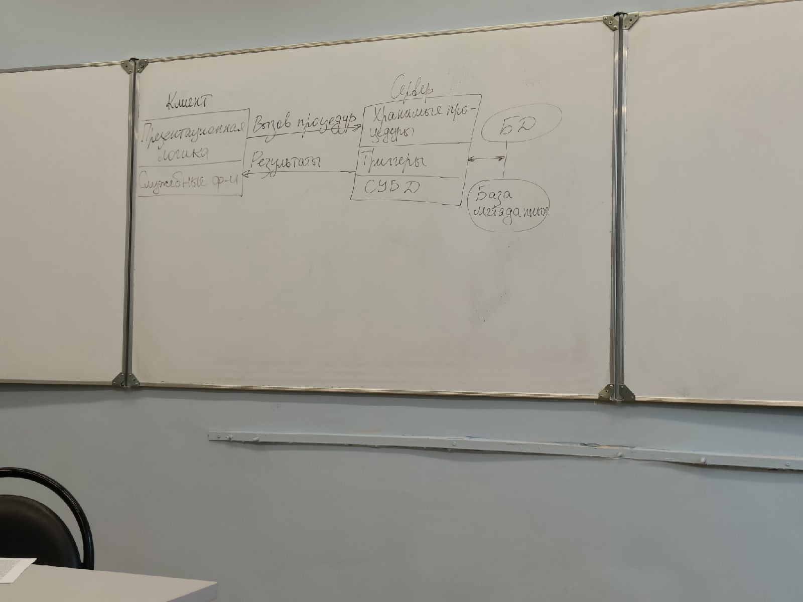

# Модель сервера БД

Для исключения недостатков модели удалённого доступа необходимого выполнение следующих доступов:

- База в каждый момент времени должна отражать текущее состояние ПрО
- БД должна отражать некоторые правила ПрО и аконы, по которым она функционирует
- Обеспечение постоянного контроля за состоянием БД, отслеживание всех изменений и адекватная реакция на них
- Возникновение некоторой ситуации в БД должно чётко и оперативно влиять на ход выполнения прикладной задачи
- Совершенствование контроля типа данных СУБД

Модель сервера БД поддерживает большинство современных СУБД. Основы данной модели составляют механизм хранимых процедур, как средство программирования SQL-сервера, механизм триггеров, как механизм отслеживания текущего состояния информационного хранилища и механизм ограничений на пользовательские типы данных, которые иногда называют механизмом поддержки доменной структуры.

В этой модели бизнес-логика разделена между клиентом и сервером. На сервере бизнес-логика реализована в виде хранимых процедур - специальных программных модулей, которые хранятся в БД и управляются непосредственно СУБД. Клиентское приложение обращается к серверу с командой запуска хранимой процедуры, а сервер выполняет эту процедуру и регистрирует все предусмотренные изменения в базе. Сервер возвращает клиенту данные выполненного запроса, которые требуются клиенту либо для вывода на экран, либо для выполнения части бизнес-логики. При этом трафик выполнения обмена информацией между клиентом и сервером резко уменьшается. 

Централизованный контроль в данной модели выполняется с использованием механизмов триггеров, которые также являются частью БД. Триггер характеризует механизм отслеживания специальных событий.

Каждый триггер представляет собой некоторую программу, которая выполняется с БД. С помощью триггеров можно вызывать хранимые процедуры.

В данной модели сервер является так как не только клиент, но и сам сервер, используя механизм триггеров, может быть инициатором обработки данных в базе. Хранимые процедуры и триггеры хранятся в словаре БД и следовательно могут быть использованы несколькими клиентами, что существенно уменьшает дублирование алгоритмов обработки данных в разных клиентских приложениях.

Недостатком данной модели является очень большая загрузка сервера, так как он обслуживает множество клиентов и выполняет следующие функции:

- осуществляет мониторинг событий, связанных с выполнением разработанных триггеров
- обеспечивает автоматическое срабатывание триггеров при возникновении связанных с ними событий
- обеспечивает выполнение внутренней программы каждого триггера
- запускает хранимые процедуры по запросам пользователей из триггеров
- возвращает требуемые данные клиенту
- обеспечивает выполнение всех функций СУБД

# Модель сервера приложений

Это трёхуровневая модель с введённым дополнительным промежуточным уровнем между клиентом и сервером, используемые для разгрузки серверов

Промежуточный уровень может одержать один или несколько серверов приложений, в данный момент компоненты приложения делятся между тремя исполнителями - клиентом, приложением и сервером БД. КЛиент обеспечивает логику представления, включая графический пользовательский интерфейс и локальные редакторы. Клиент исполняет функции front-end части приложения, обеспечивающие его доступ в локальную или глобальную сеть. Дополнительная реализация взаимодействия между клиентом и сервером может включать в себя управления распределёнными транзакциями, что соответствует случаям, когда клиент также является клиентом-менеджером распределённых транзакций.

Сервер-приложения спроектированы для исполнения общих незагружаемых функций клиента. Серверы приложений поддерживают функции клиента как частей, взаимодействующих рабочих групп, сетевую доменную ОС и каталоги с данными, а также хранят и исполняют наиболее общие правила бизнес-логики, обеспечивают обмен сообщениями и поддержку запросов.

Серверы БД в этой модели занимаются исключительно функциями СУБД, кроме того на них возлагаются функции создания резервных копий и восстановления БД после сбоя, управлением выполнения транзакций и поддержки устаревших приложений. Данная модель обладает большой гибкостью чем двухуровневые модели. В ней большая часть бизнес-логики клиента изолирована от возможности встроенного языка SQL, реализованного в конкретной СУБД и может быть выполнена на языках программирования высокого уровня, что повышает переносимость системы и её масштабируемость.

# Модели серверов БД

При создании первых СУБД технология клиент-сервер только зарождалась, поэтому изначально в их архитектуре не было адекватного механизма организации взаимодействия клиентского и серверного процесса. В основном такой механизм определялся структурой реализации серверных процессов и часто называется архитектурой серверов БД. Первым этапом эволюции этих механизмов можно назвать момент выделения сервера в самостоятельную группу, имеющей функции управления данными.
