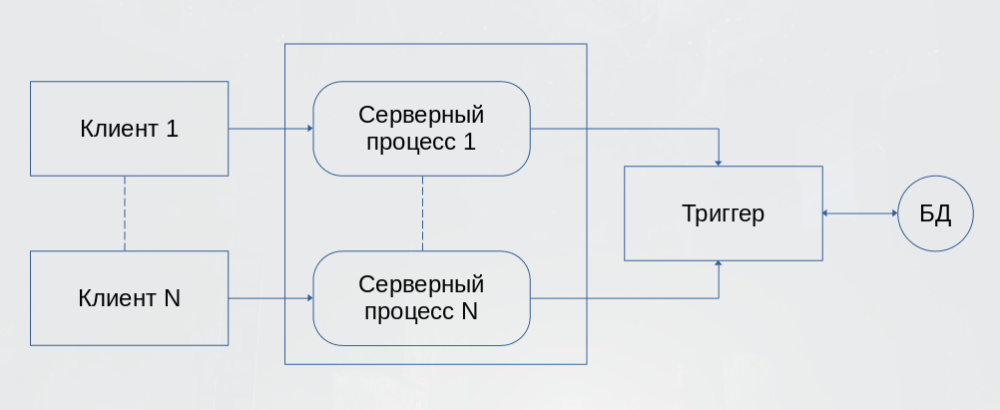
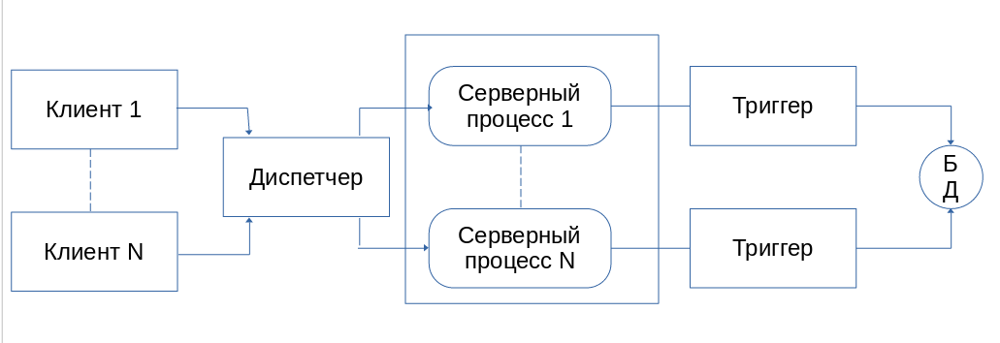
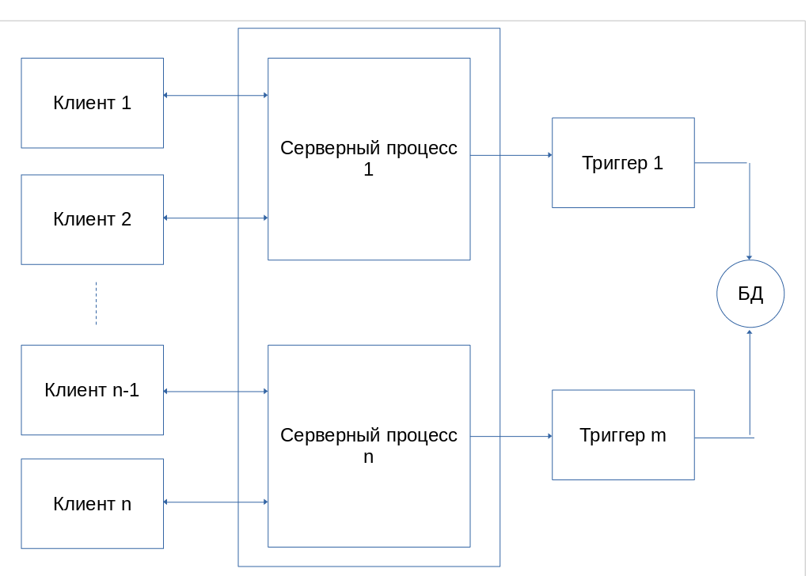

Изначально функцией сервера и взаимодействия с пользователем объединялись в одной программе. Этот этап развития серверов можно назвать нулевым.

Затем функции управления данных были выделены в отдельную группу - сервер. Однако при этом модель взаимодействия пользователя с сервером соответствовала структуре связей между таблицами и БД 1 к 1. 

Выделение сервера в отдельную программу позволило поместить его на отдельную машину, а интерфейс с пользователем на другую и осуществлять взаимодействие по сети. Однако, необходимость запуска большого числа серверов сильно ограничивала возможности такой системы. Для обслуживания большого числа клиентов на сервере следовало одновременно запустить работу многих серверных процессов, что резко повышало требования к ресурсам ЭВМ.

Логически каждый клиент связан с сервером отдельной нитью или потоком, по которому пересылаются запросы - это  многопотоковая односерверная архитектура. Эта архитектура позволяет значительно уменьшить нагрузку на ОС, возникающая при работе с большим количеством пользователей.

Однако, такое решение имеет свои недостатки, так как сервер может выполняться только на одном процессоре, возникает естественно ограничение на применение СУБД для мультипроцессорных платформ. В некоторых системах эта проблема решается вводом промежуточного диспетчера, и созданная таким образом система называется

Недостатки такой архитектуры:

1. В систему добавляется новый слой. При добавлении нового слоя увеличивается потребность в ресурсах на поддержку баланса загрузки серверов.
2. Ограничивает возможности управления взаимодействием между клиентом и сервером (невозможно отправить запрос от конкретного клиента к конкретному серверу и серверы становятся равноправными, т.к. нет возможности устанавливать приоритеты для обслуживания запросов)

Учёт приоритетов клиентов особенно важен в системах оперативной обработки транзакций. Однако именно эту возможность не может предоставить архитектура систем с диспетчером.

Современное решение проблемы СУБД для мультипроцессорных платформ заключается в возможности запуска нескольких серверов БД в т.ч. и на различных процессорах. При этом каждый из серверов должен быть многопоточным. Если эти два условия выполняются, то такую архитектуру называют многопотоковой серверной архитектурой.

Данная архитектура имеет распараллеливание, выполнение одного пользовательского запроса несколькими серверными процессами.

Типы параллелизма:

- горизонтальный - хранимая в базе информация по горизонтали
- вертикальный - по вертикали
- смешивание