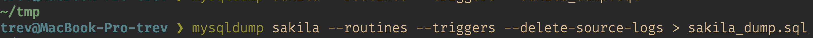

# Лабораторная работа №1

Хохлов Т.А. ТМП-71

1. Создадим резервную копию всех БД:

2. Восстановим все БД с помощью созданной резервной копии:

3. Создадим резервную копию БД sakila с триггерами и хранимыми процедурами:

4. Восстановим БД sakila:

5. Восстановим через двоичные файлы:

6. Создадим отдельно дамп с данными и дамп с определениями таблиц:

7. Произведём восстановление с помощью наших двух дампов:

8. Создадим резервную копию таблицы actor в формате разграниченного текста:

9. Восстановим таблицу:

