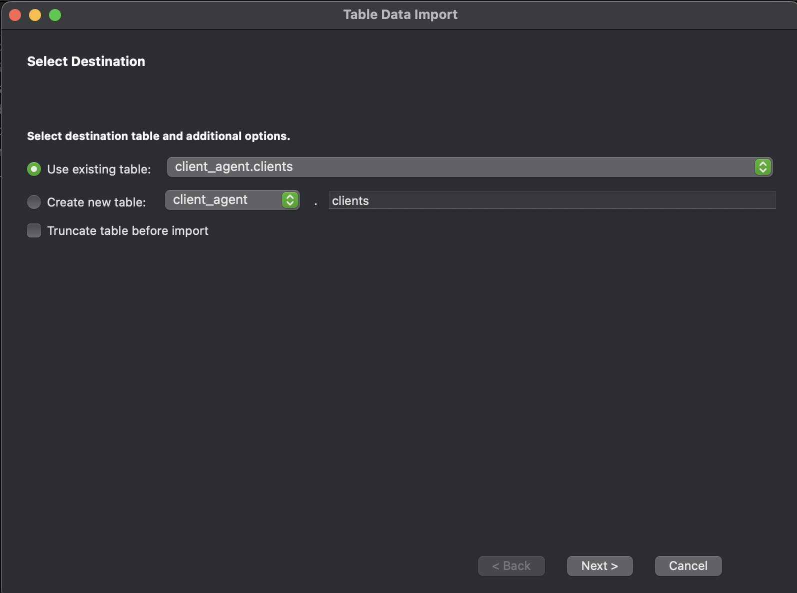
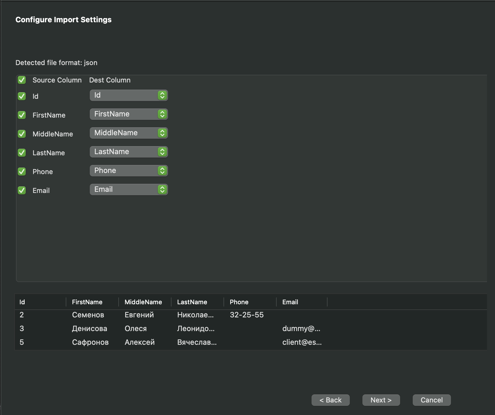
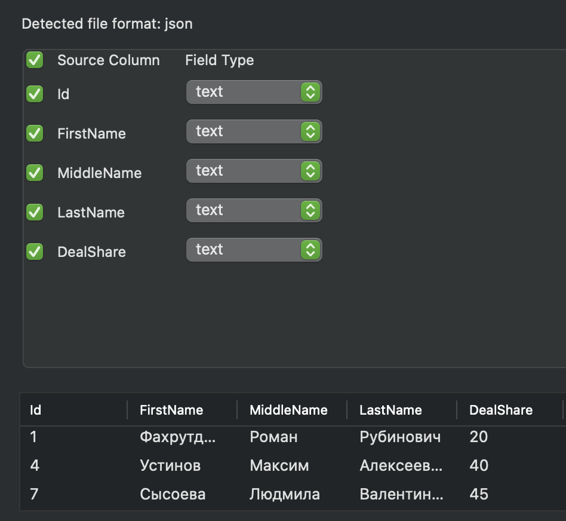

# Лабораторная работа №4

## Импортирование файлов из Excel

1.	Создать базу данных.


2.	Произвести импорт данных из файла clients.csv с помощью графического интерфейса MySQL Workbench. Таблицу клиенты предварительно создать.







3.	Произвести импорт данных из файла agents.csv с помощью графического интерфейса MySQL Workbench. Таблицу агенты предварительно создавать НЕ надо. Создать таблицу необходимо при импорте данных.




4.	Таблицу клиенты очистить. Не удалить, а именно очистить. Произвести импорт данных из файла clients.csv с помощью команды LOAD DATA.

Очистим таблицу:

```sql
TRUNCATE TABLE clients;
```


```sql
LOAD DATA INFILE "/Users/trev/Downloads/clients.csv" INTO TABLE clients COLUMNS TERMINATED BY ',' IGNORE 1 LINES (id, FirstName, MiddleName, LastName, Phone, Email);
```


5.	Таблицу агенты очистить. Произвести импорт данных из файла agents.csv с помощью команды LOAD DATA.

Очистим таблицу:

```sql
TRUNCATE TABLE agents;
```


```sql
LOAD DATA INFILE "/Users/trev/Downloads/agents.csv" INTO TABLE agents COLUMNS TERMINATED BY ',' IGNORE 1 LINES (id, FirstName, MiddleName, LastName, DealShare);
```


