# Лабораторная работа №2

Хохлов Т. А. ТМП-71

## Пользователи и роли

1. Создать пользователей: 2 администраторов (admin1, admin2), 2 редакторов (editor1, editor2), 2 клиентов (user1, user2). Админам и редакторам поставить пароль при создании. Админы могут заходить на сервер только с локального хоста, остальные пользователи – с любых хостов:

- Администраторы:

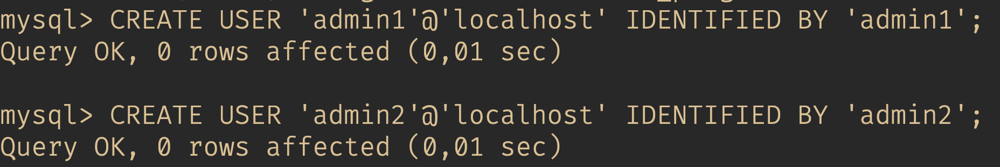

- Редакторы:

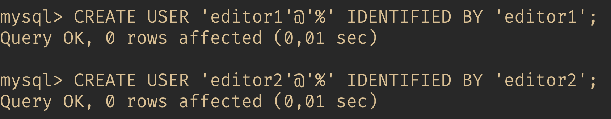

- Обычные пользователи:

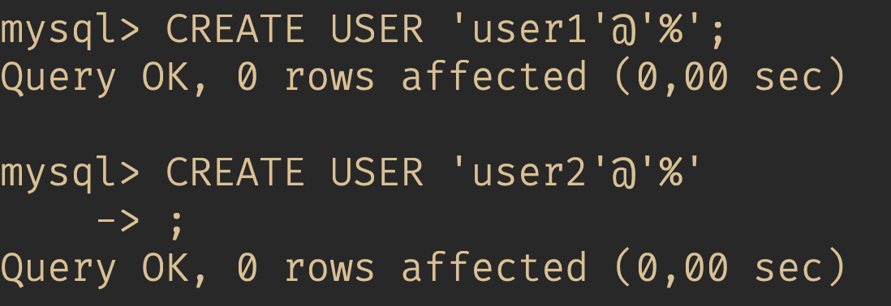

2. Создать анонимного пользователя для локального хоста:

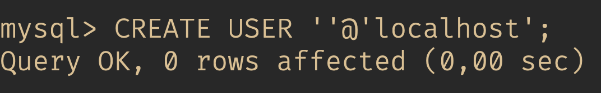

3. Создать роли на каждую группу пользователей (admin_role, editor_role, user_role):

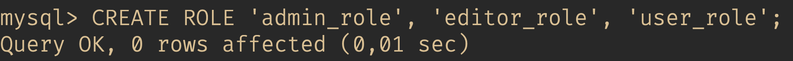

4. Администраторам через роль выдать все привилегии на уровне сервера, с возможностью давать свои привилегии другим пользователям:

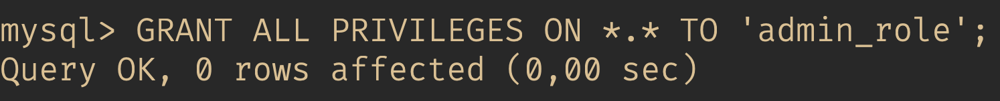

5. Редакторам через роль выдать привилегии, позволяющие вставлять, удалять и изменять данные в таблицах и производить выборку данных на уровне базы данных "sakila":

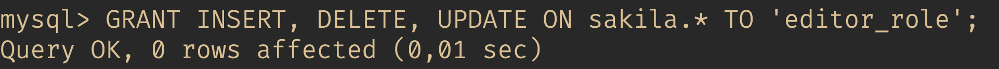

6. Клиентам через роль выдать привилегии на выборку данных из представлений "film_list" и "actor_info" в базе данных "sakila":

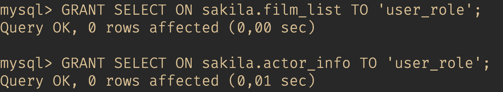

7. Задать глобальную политику истечения пароля каждые 6 месяцев. Отдельно задать политику для администраторов, им необходимо менять пароль каждый месяц:

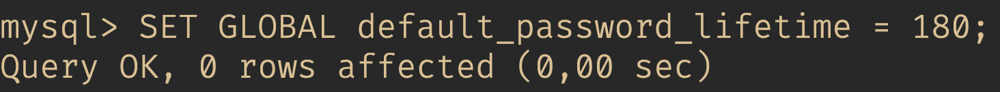
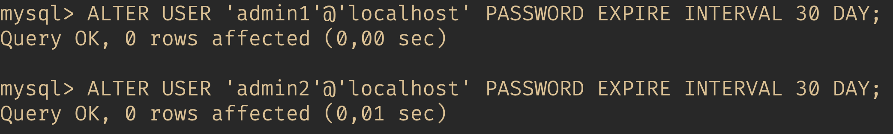

8. Созданным пользователям "активировать" все роли по умолчанию, использовать команду SET DEFAULT ROLE:

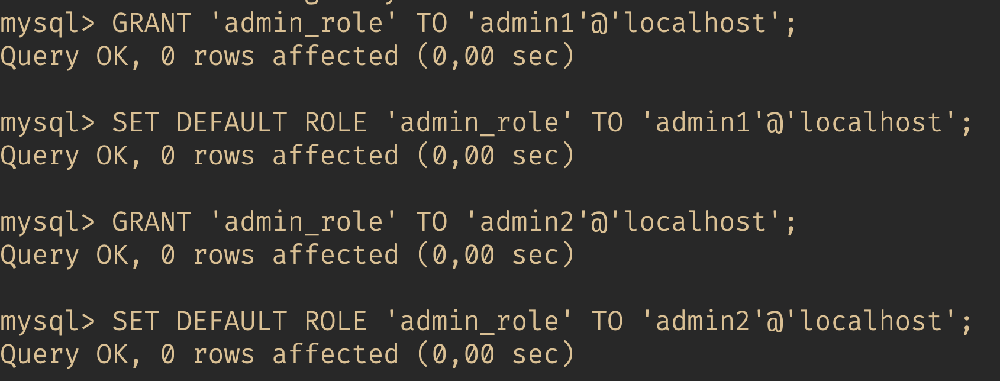
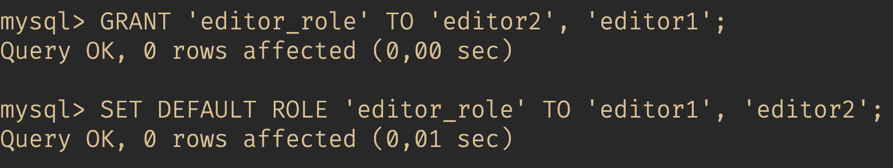
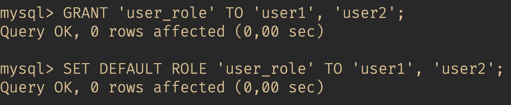

9. Проверить привилегии для пользователей (по одному пользователю из администраторов, редакторов и клиентов);

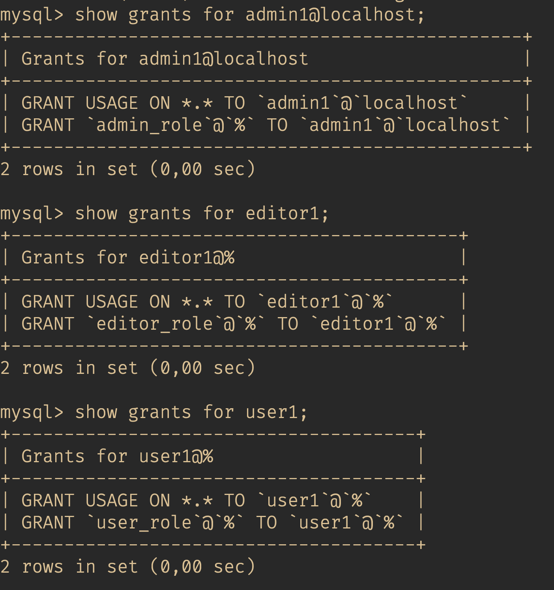

10.	Подключиться к серверу через одного из администраторов:

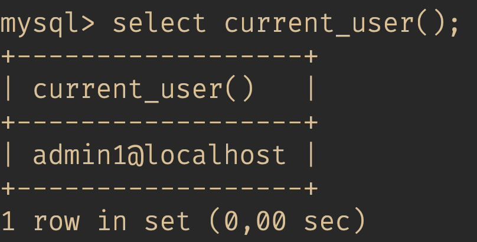

11.	Заблокировать одного из клиентов:

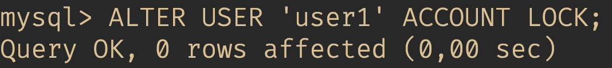

12.	Поменять пароль самому себе и второму клиенту:

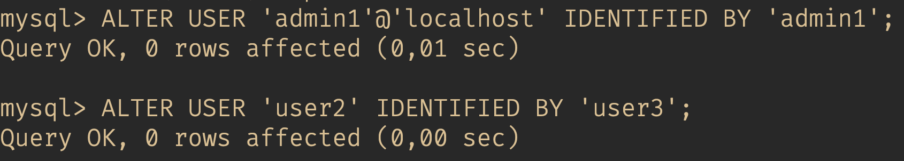

13. Задать обоим редакторам ограничение на количество изменений в час = 100.

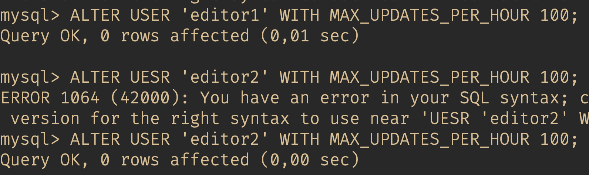
