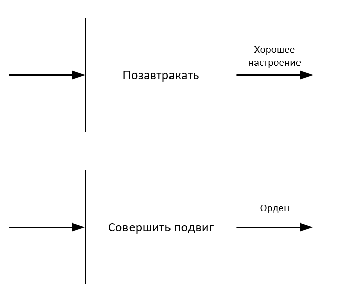
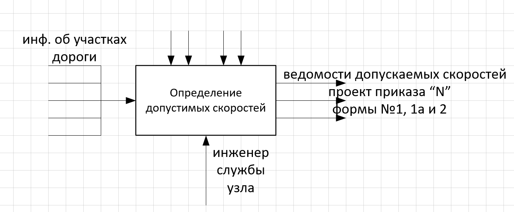

# Типы связей между работами

9. Временная связь

   Она возникает между функциями, которые должны выполняться одновременно до или одновременно после любой функции

   

10. Случайная связь

    Она возникает когда конкретная связь между функциями мала или полностью отсутствует

    

# Правила рекомендации по построению диаграммы IDEF0

1. Перед построением модели IDEF0 необходимо определиться, какая модель системы будет построена.

   Определение позиции, с которой строится модель, а также позиции, с точки зрения которой строится модель.

2. На контекстной диаграмме изображается один блок, указывающий назначение системы

   Рекомендуется изображать по две-четыре стрелки входящей и выходящей с каждой стороны.

3. Количество блоков в декомпозиции рекомендуется от 3 до 6.
4. Блоки на диаграмме декомпозиции следует располагать слева направо, сверху вниз.

При построении диаграмм для лучшей их читабельности может использоваться механизм туннелирования стрелок.

11. Все стрелки, входящие и выходящие из блока, при построении диаграмм должны быть отображены на ней. Имена стрелок, перенесённых на диаграмму должны совпадать с именами, указанными на диаграмме верхнего уровня
12. Если две стрелки проходят параллельно (начинаются из одной и той же грани одной работы и заканчиваются на одной и той же грани другой работы), то по возможности следует их объединить и называть единым термином

    

13. Каждый блок на диаграммах должен иметь свой номер

    

В современных CASE-средствах нумерация происходит автоматически.

Диаграмма дерева узлов показывает иерархию работ в модели и позволяет просмотреть всю модель целиком, но не показывать взаимосвязи между моделями.

Диаграммы только для экспозиции называются FEO (For Exposition Only). Данные диаграммы часто используются в модели для иллюстрации других точек зрения, при отображении отдельных деталей, которые не поддерживаются синтаксимом IDEF0. Диаграмма FEO позволяет нарушить любое синтаксическое правило, поскольку является просто картинкой.

