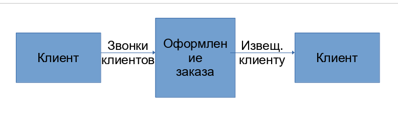
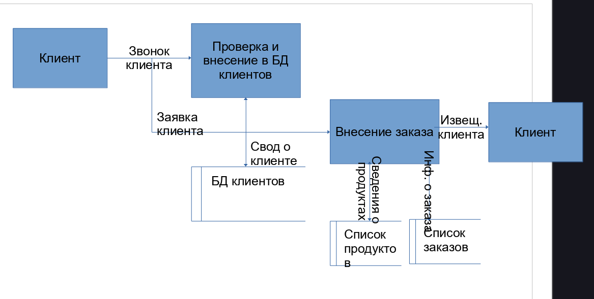

# Диаграммы потоков данных (DFD)

Диаграммы потоков данных (DFD) являются основным средством моделирования функциональных требований проектируемой системы. С их помощью эти требования разбиваются на функциональные компоненты (процессы) и представляются в виде сети связанных потоками данных. Главная цель таких средств - продемонстрировать, как каждый процесс преобразует свои входные данные в выходные, а также выявить отношения между этими процессами. 

При создании диаграммы DFD используются 4 основных понятия:

- потоки данных 
- процессы (работы) преобразования входных потоков данных в выходные
- внешние сущности
- накопители данных (хранилище)

Для построения DFD используют две разные нотации:

- Йордана де Марко
- Гейна-Сарсона

Основные элементы диаграммы:

- потоки данных являются механизмами для передачи информации из одной части системы в другую. Потоки на диаграмме изображаются именованными стрелками, ориентация которых указывает направление движения информации
- процессы служат для преобразования входных потоков данных в выходные. Имя процесса должно содержать глагол в неопределённой форме с последующим дополнением (получить документы по отгрузке продукции). Каждый процесс должен иметь уникальный номер.
- хранилище (накопитель данных) моделирует данные, которые будут сохраняться в памяти между процессами.

| Компонент | Йордана | Гейна-Сарсона |
|-----------|---------|---------------|
| поток данных | ---> | ---> |
| процесс | круг а внутри имя функция номер |  прямоугольник номер имя |
| хранилище | прямоугольник без левой и правой границы имя | прямоугольник без правой границы с дополнительной линией слева имя |
| внешняя сущность | прямоугольник имя | прямоугольник с выделенной левой и верхней границей имя |

1. Размещать на диаграмме от 3 до 6 процессов
2. Не загромождать диаграммы несуществующими на данном уровне деталями
3. Декомпозицию потоков данных осуществлять параллельно с декомпозицией процессов
5. Однократно определять функционально идентичные процессы на самом верхнем уровне, где такой процесс необходим и ссылаться к нему на нижних уровнях
6. Пользоваться простейшими диаграммами-техниками: если что-то возможно описать с помощью DFD, то это и необходимо делать, а не использовать более сложные для описания объекты
