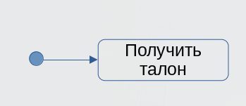
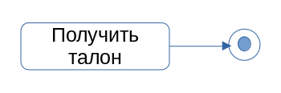
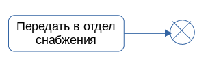
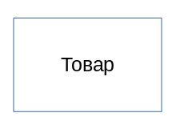
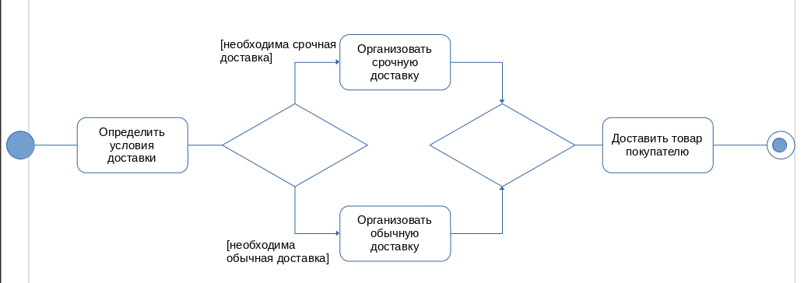
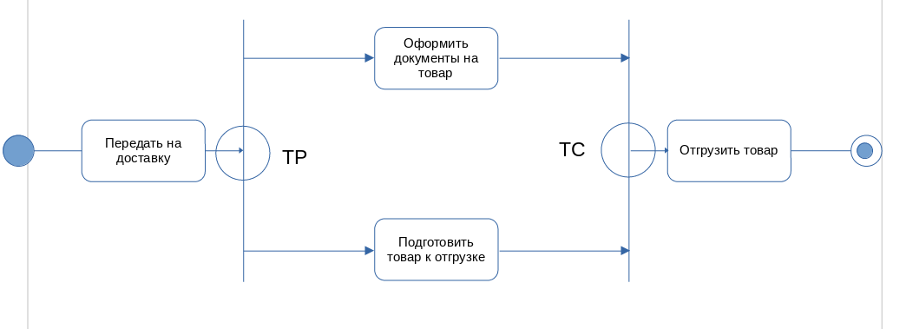
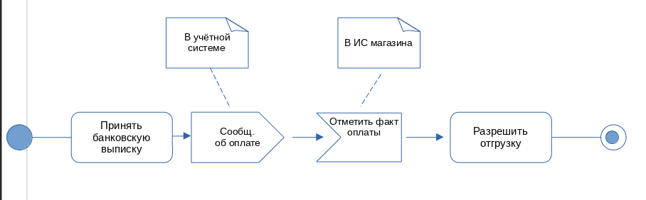
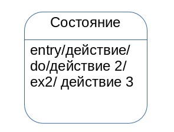

# Диаграмма деятельности

Диаграмма вариантов использования даёт представление, что должна делать система. На вопрос как она должна делать можно ответить с помощью диаграммы деятельности. Диаграмма деятельности показывает последовательность действий, необходимых для достижения цели. Действия (action) - это элементарные шаги, которые не предполагают дальнейшую декомпозицию.

Деятельность может содержать входящие и выходящие дуги деятельности, показывающие потоки управления и потоки данных. Если поток соединяет две деятельности, он называется потоком управления. Если поток заканчивается объектом, он называется потоком данных. Диаграмму деятельности следует располагать таким образом, чтобы действия следовали слева направо и сверху вниз.

# Основные графические элементы

1. Узел управления

Это абстрактный узел действия, который координирует потоки действия

2. Начальный узел деятельности (начальное состояние деятельности)

Является узлом управления, в котором начинается поток при вызове данной деятельности

3. Конечный узел деятельности (конечное состояние деятельности)

Является узлом управления (деятельности), которое останавливает все потоки данной диаграммы деятельности.

4. Конечный узел потока (конечное состояние)

Является узлом управления, которое завершает поток.

5. Объект

## Ветвление

Узел решения предназначен для определения правила ветвления и различных вариантов дальнейшего развития сценария

## Разделение и слияние

Для отображения условий, соответствующих логическому оператору "И", на диаграмме используется синхронизационная черта. Точка разделения обеспечивает разделение одного потока на несколько параллельных потоков. Входит ровно в один поток. Точка синхронизации обеспечивает синхронизацию нескольких параллельных потоков. Входит два и более потока, причём эти потоки выполняются параллельно, выходит один поток. Причём в точке слияния параллельные потоки синхронизируются.

Отправка сигнала - действие, которое на основе своих входов создаёт экземпляр сигнала и передаёт его внешней системе, которое обрабатывает полученное сообщение

| Пользователь | ИС |
| --- | --- |
| Зайти на сайт | |
| Авторизоваться | |
| | Проверка данных |

# Диаграмма состояния

Диаграмма состояния показывает состояние одиночного объекта с момента его создания и до его уничтожения, события и сообщения, которые выходят переход из одного состояния в другое и действия, являющиеся результатом смены состояния.

# Основные элементы диаграммы состояния

1. Автомат - описание последовательности состояний, через которое проходит объект на протяжение всего жизненного цикла, и реагирует на события, в том числе описание реакций на эти события.

2. Состояние - это ситуация в жизни объекта, на протяжении которой он удовлетворяет некоторому условию, осуществляет определённую деятельность или ожидает какого-то события

3. Псевдосостояние - вершина в конечном автомате, которая имеет форму состояния, но не обладает поведением. В языке UML определены конечные и начальные состояния. Начальное состояние - разновидность псевдосостояния, обозначающее начало выполнения процесса изменения состояния дальнейшего автомата или нахождения моделируемого объекта в составном состоянии. В этом состоянии объект находится по умолчанию в начальный момент времени. Изображается также как в диаграмме деятельности, закрашенным кружком. Конечное состояние - разновидность псевдосостояния, обозначающее прекращение процесса изменения, в состояние конечного автомата. В конечном состоянии объект находится непосредственно перед уничтожением.

4. Действие - одиночное вычисление, которое приводит к возврату значения или смене значения

<Метка действия/выражение действия>

Типы меток:

1. Входное действие (entry action) <\entry> - действие, которое выполняется в момент перехода в это состояние.

2. Действие выхода (exit action) <\exit> - действие, производимое при выходе из этого состояния.

3. Внутренняя деятельность (do activity) <\do> - выполнение объектом операции и процедур, которое требует определённого времени