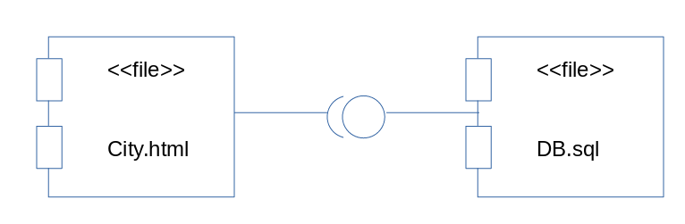
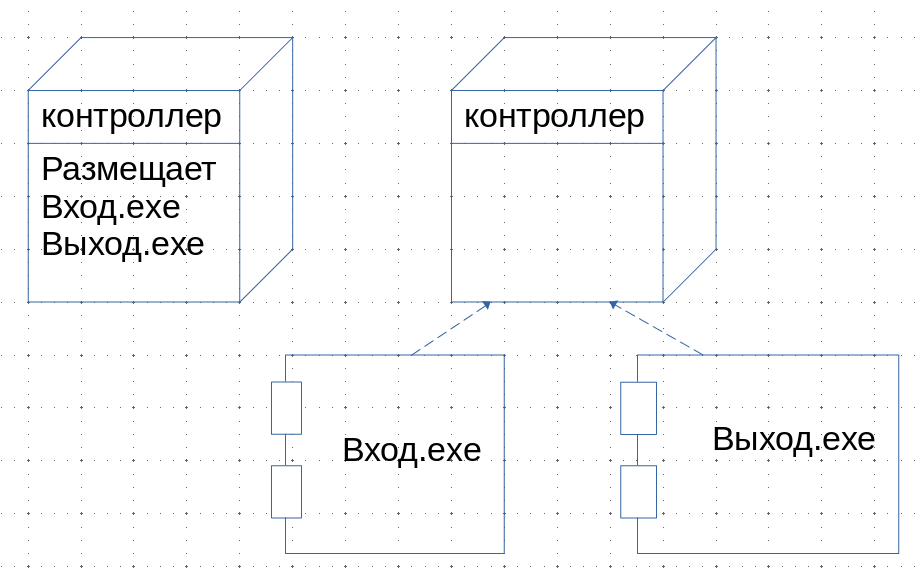

# Диаграмма реализации

Состоит из диаграммы компонентов и диаграммы развёртывания.

## Диаграмма компонентов

Цель диаграммы компонентов - показать разбиение программной системы на структурные компоненты и связи между компонентами.

### Разновидности компонентов

1. <<\executable>> - компонент, который может выполняться в физическом узле
2. <<\library>> - статическая или динамическая библиотека
3. <<\file>> - файл, содержащий код программы
4. <<\table>> - компонент, который представляет базу данных
5. <<\document>> - документ

## Диаграмма развёртывания

Показывает конфигурации обрабатываемых узлов в период работы системы, а также компоненты, живущие в них. Элементами диаграммы являются узлы, а также отношения зависимости и ассоциации. На диаграмме развёртывания могут использоваться примечания и ограничения.

Узел - физический элемент, который существует в период работы системы и представляет собой компьютерный ресурс, имеющий память и способность обработки. Узел может иметь дополнительную секцию, отображающую размещённые в нём элементы.
