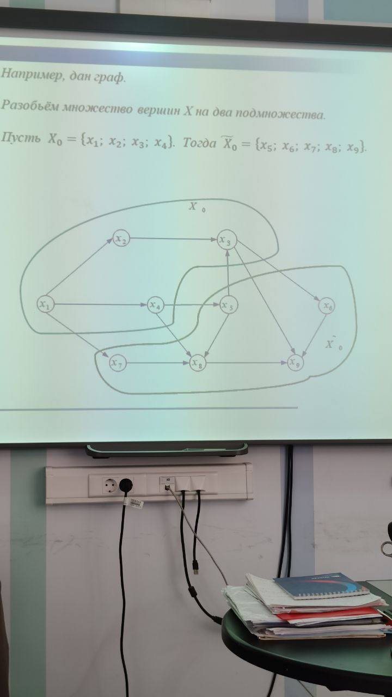

# Задача о максимальном потоке в сети

Важной задачей теории графов является задача определения максимального потока, проходящего из источника в сток графа.

Под сетью понимается пара (G, q), где G = (X,A) - ориентированный граф, а q - функция, которая каждой дуге $(x_i, x_j)$ ставит в соответствие неотрицательное число, называемое пропускной способностью дуги. Эта функция показывает величину максимального потока, который может протекать по данной дуге.

## Разрезы графа

Множество вершин графа x можно разбить на два подмножества $X_0$ и $\~X_0$ таким образом, что $\~X_0$ является дополнением X_0 до множества X.

Разрезом графа называется совокупность всех дуг, начальные вершины которых лежат в множестве $X_0$, а конечные вершины - в множестве $\~X_0$.

Например, дан граф.

Разобьём множества вершин X на два подмножества.

Пусть $X_0=\{x_1;x_2;x_3;x_4\}$. Тогда $\~X_0=\{x_5;x_6;x_7;x_8;x_9\}$.

В разрез графа попадут дуги:

$(X_0 \rightarrow \~X_0): (x_1,x_7); (x_3,x_6); (x_3,x_9);(x_4,x_5); (x_4,x_8)$

Потоком графа называется совокупность чисел $\xi_{ij}$ соответствующих дугам $(x_i, x_j)$, причём $0 \le \xi_{ij} \le q_{ij}$ и удовлетворяющих следующему условию:

$$
\sum\limits_{x_j\in D(x_i)} \xi_{ij} - \sum\limits_{x_k\in D^{-1}(x_i)} \xi_{ij} = \begin{cases}
  \nu, \space если\space x_i = s \\
  -\nu,\space если\space x_i = t \\
  0,\space если \space x_i \ne s\space и \space x_i \ne t
\end{cases}
$$

Эта формула называется уравнения сохранения потока: Поток, входящий в вершину, равен потоку, выходящему из вершины, кроме вершин S и t. Поток, выходящий из источника S. равен потоку, входящему в сток t, и равен величине минимального разреза графа.

Задача о максимальном потоке состоит в нахождении максимального значения величины $\nu$.

$$
\nu = \sum\limits_{x_j\in D(s)} \xi_{sj} = \sum\limits_{x_k\in D^{-1}(t)} \xi_{kt}
$$

<u>Теорема.</u> Величина максимального потока из источника S в сток t равна проускной способности минимального разреза, разделяющего S и t, причём существует поток, достигающий этого значения.

Разрез графа будет отделять s от t, если $s\in X_0$, а $t\in \~X_0$

Величиной разреза называется сумма пропускных способностей дуг, входящих в разрез.

Минимальный разрез - это разрез с минимальной величиной потока

$$
\nu = \sum\limits_{(x_i,x_j)\in (X_0\rightarrow \~X_0)} q_{ij} \rightarrow \min
$$

Величина максимального потока равна величине минимального разреза

$$
\xi_{\max} = \nu_{\min} = \sum\limits_{(x_i,x_j)\in (X_0\rightarrow \~X_0)} q_{ij}
$$

## Алгоритм Форда-Фалкерсона

Алгоритм основан на приписывании вершинам графа пометок.

Вершины графа могут находиться в трёх состояниях:

1) вершина не помечена;
2) вершина помечена, но не просмотрена, т.е. сама вершина имеет пометку, а смежные с ней вершины - нет;
3) вершина помечена и просмотрена, т.е. сама вершина и смежные с ней вершины имеют пометки.

Пометка вершины имеет вид: $l(x_i)=(\pm x_k; \delta(x_i))$, где

- $+x_k$ обозначает, что вдоль дуги $(x_k, x_i)$ допускается увеличение потока на величину $\delta (x_i)$;
- $-x_k$ обозначает, что вдоль дуги $(x_i, x_k)$ допускается уменьшение потока на величину $\delta (x_i)$;

Присвоение произвольной вершине $x_i$ пометки соответствует нахождению потока от источника S до текущей вершины $x_i$

Алгоритм делится на две части: расстановка пометок и изменение потока.

### Расстановка пометок

Пусть $\xi_{ij}^{(0)}=0$.

<u>Пункт 1.</u> Присвоим источнику S пометку $l(s)=(+s; +\infty)$.

<u>Пункт 2.</u> Возьмём некоторую помеченную, но не просмотренную вершину $x_i$. Предположим, что её пометка имеет вид: $l(x_i) = (+x_k; \delta(x_i))$.

1. Каждой непомченной вершине $x_j\in D(x_i)$, для которой $\xi \le q_{ij}$, присвоим пометку $l(x_j) = (+x_i, \min{\{ \delta(x_i); q_{ij} - \xi_{ij} \}})$.
2. Каждой непомеченной вершине $x_j\in D^{-1}(x_i)$, для которой $\xi_{ji} > 0$, присвоим пометку $l(x_j) - (-x_i, \min{\{ \delta(x_i); \xi_{ji} \}})$.

Теперь вершина $x_i$ помечена и просмотрена, т.е. она сама и смежные с ней вершины имеют пометки.

Пункт 2 повторяется до тех пор пока:

- либо вершина стока не получит пометку и тогда перейдём к пункту 3,
- либо будет доказано, что вершину стока пометить нельзя. В этом случае алгоритм заканчивает свою работу с максимальным значением потока $\xi$.

Обозначим через $X_0$ - множество помеченных вершин, а через $\~X_0$ - множество непомеченных вершин.

Тогда разрез $(X_0\rightarrow\~X_0)$ является минимальным разрезом.

### Изменение потока

<u>Пункт 3.</u> Пусть $x_i = t$.

<u>Пункт 4.</u>

- если пометка в вершине $x_i$ имеет вид

$l(x_i) = (+x_k; \delta(x_i))$, то увеличиваем поток вдоль дуки $(x_k, x_i)$ на величину $\delta(t)$:

$$
\xi_{ij}^{(n)}(x_k, x_i) = \xi_{ij}^{(n-1)}(x_k, x_i)+\delta(t)
$$

- если пометка в вершине $x_i$ имеет вид

$l(x_i)=(-x_k;\delta(x_i))$, то уменьшаем поток вдоль дуги $(x_i, x_k
)$ на величину $\delta(t)$:

$$
\xi_{ij}^{(n)}(x_i, x_k) = \xi_{ij}^{(n-1)}(x_i, x_k)-\delta(t)
$$

<u>Пункт 5.</u> Если $x_k\ne s$, то положим $x_i=x_k$ и вернёмся к пункту 4. Если же $x_k=s$, т.е. достигнут источник, то стираем все пометки и возвращаемся в пункту 1, чтобы вновь расставлять пометки, используя уже изменённый поток, найденный в пункте 4.