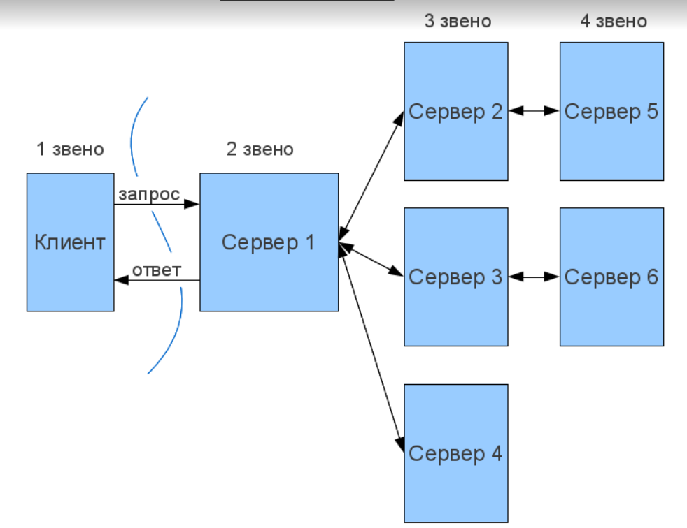

**Архитектура «клиент-сервер»** определяет общие принципы организации взаимодействия в сети, где имеются серверы, узлы-поставщики некоторых
специфичных функций (сервисов) и клиенты (потребители этих функций). Практические реализации такой архитектуры называются клиент-серверными
технологиями.

**Двухзвенная архитектура** - распределение трех базовых компонентов между
двумя узлами (клиентом и сервером).Двухзвенная архитектура используется в
клиент-серверных системах, где сервер отвечает на клиентские запросы
напрямую и в полном объеме.

Расположение компонентов на стороне клиента или сервера определяет следующие основные модели их взаимодействия в рамках двухзвенной архитектуры:

- **Сервер терминалов** — распределенное представление данных.
- **Файл-сервер** — доступ к удаленной базе данных и файловым ресурсам.
- **Сервер БД** — удаленное представление данных.
- **Сервер приложений** — удаленное приложение.

**Клиент** – это браузер, но встречаются и исключения (в тех случаях, когда один веб-сервер (ВС1) выполняет запрос к другому (ВС2), роль клиента играет веб-сервер ВС1). В классической ситуации (когда роль клиента выполняет браузер) для того, чтобы пользователь увидел графический интерфейс приложения в окне браузера, последний должен обработать полученный ответ веб-сервера, в котором будет содержаться информация, реализованная с применением HTML, CSS, JS (самые используемые технологии). Именно эти технологии «дают понять» браузеру, как именно необходимо «отрисовать» все, что он получил в ответе.

**Веб-сервер** – это сервер, принимающий HTTP-запросы от клиентов и выдающий им HTTP-ответы. Веб-сервером называют как программное обеспечение, выполняющее функции веб-сервера, так и непосредственно компьютер, на котором это программное обеспечение работает. Наиболее распространенными видами ПО веб-серверов являются Apache, IIS и NGINX. На веб-сервере функционирует тестируемое приложение, которое может быть реализовано с применением самых разнообразных языков программирования: PHP, Python, Ruby, Java, Perl и пр.

**База данных** фактически не является частью веб-сервера, но большинство приложений просто не могут выполнять все возложенные на них функции без нее, так как именно в базе данных хранится вся динамическая информация приложения (учетные, пользовательские данные и пр).

**База данных** - это информационная модель, позволяющая упорядоченно хранить данные об объекте или группе объектов, обладающих набором свойств, которые можно категоризировать. Базы данных функционируют под управлением так называемых систем управления базами данных (далее – СУБД). Самыми популярными СУБД являются MySQL, MS SQL Server, PostgreSQL, Oracle (все – клиент-серверные).

**Трехзвенная архитектура** - сетевое приложение разделено на две и более частей, каждая из которых может выполняться на отдельном компьютере. Выделенные части приложения взаимодействуют друг с другом, обмениваясь сообщениями в заранее согласованном формате.

Третьим звеном в трехзвенной архитектуре становится сервер приложений, т.е. компоненты распределяются следующим образом:

1. Представление данных — на стороне клиента.
2. Прикладной компонент — на выделенном сервере приложений (как вариант, выполняющем функции промежуточного ПО).
3. Управление ресурсами — на сервере БД, который и представляет запрашиваемые данные.

Трехзвенная архитектура может быть расширена до **многозвенной (N-tier, Multi-tier)** путем выделения дополнительных серверов, каждый из которых будет представлять собственные сервисы и пользоваться услугами прочих серверов разного уровня.

Двухзвенная архитектура проще, так как все запросы обслуживаются одним сервером, но именно из-за этого она менее надежна и предъявляет повышенные требования к производительности сервера.

Трехзвенная архитектура сложнее, но, благодаря тому, что функции распределены между серверами второго и третьего уровня, эта архитектура предоставляет:

1. Высокую степень гибкости и масштабируемости.
2. Высокую безопасность (т.к. защиту можно определить для каждого сервиса или уровня).
3. Высокую производительность (т.к. задачи распределены между серверами).

**Распределённое приложение**– это программа, состоящая из нескольких взаимодействующих частей, каждая из которых, как правило, выполняется на отдельном компьютере (или другом устройстве) сети.

**Распределённая система** – программно-аппаратное решение, состоящее из компонентов, функционирующих на физически удаленных и независимых друг от друга гетерогенных узлах, представляющееся пользователям единой объединенной системой.

Свойства Распределённых систем:

- управляемость - способность системы эффективно контролировать свои составные части;
- производительность - обеспечивается за счет возможности перераспределения нагрузки на серверы системы с помощью управляющего ПО;
- масштабируемость - при необходимости физического повышения производительности распределенная система может легко интегрировать в своей транспортной среде новые вычислительные ресурсы;
- расширяемость - к распределенным приложениям можно добавлять новые составные части (серверное ПО) с новыми функциями.

### Недостатки распределённых систем:

- коммуникационная среда – слабое место распределённых систем, поэтому ошибки в таких системах возникают чаще, чем в монолитных;
- архитектура распределённого приложения сложнее, чем монолитного.

### Требования к распределённым системам:

- использование открытых стандартов для обеспечения независимости от конкретной платформы и работы программных систем в гетерогенной среде;
- безопасность, включает в себя:
  - o конфиденциальность,
  - o целостность,
  - o доступность;
- обеспечение качества обслуживания (QoS) в сети.
