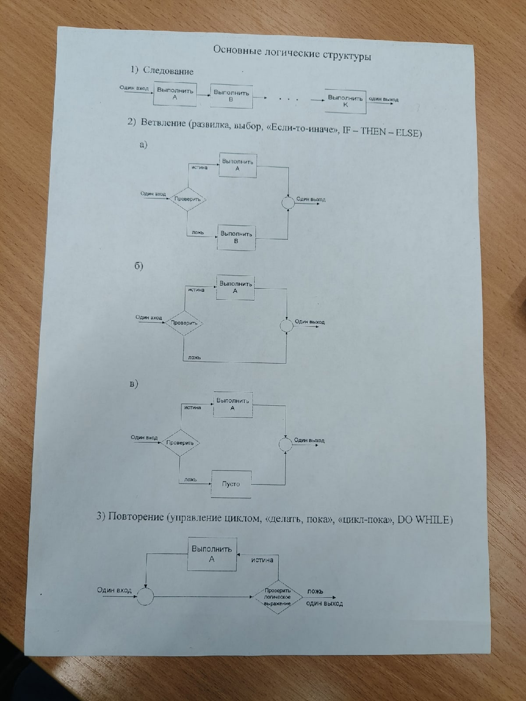

Второй принцип:

Любая программа представляет собой структуру, построенную из трёх типов базовых конструкций: следование, ветвление и повторение. Кружок - слияние двух или более элементов, а стрелки указывают возможных преемников каждого элемента схемы.

Следование - это самая важная из структур, представляющая собой последовательность блоков, это означает, что блоки выполняются друг за другом, в порядке следования программы. Эти прямоугольники могут представлять как один единственный оператор, так и множество операторов, необходимых для выполнения сложных вычислений.

Ветвление - это структура, которая в зависимости от выполнения заданного условия обеспечивает выбор для исполнения одного из двух заданных в структуре блоков, каждый из путей ведёт к общей точке слияния, так что обработка продолжается независимо от того, какой путь был выбран. Выбираемые пути могут помечаться метками. Может оказаться, что для одного из результатов проверки ничего предпринимать не надо, в этом случае можно применять только один обрабатывающий блок, или можно указать блок без действий и помечать его "Пусто".

Повторение - данная структура представляет собой цикл, в котором блок А исполняется повторно, пока проверяемое выражение истинно, как только оно становится ложным, цикл заканчивается, так как выражение, управляющее циклом, проверяется в самом начале, то проверяемое условие может сразу оказаться ложным. В этом случае блок А вообще не может выполняться. Существенная особенность всех этих структур, что каждый из них имеет только один вход и только один выход, что и обеспечивает хорошую структуру программы.

В теории программирования доказана теорема о том, что любая программа, не содержащая зацикливаний и недостижимых операторов, может быть построена только из указанных выше логических структур. Все эти структуры определяются рекурсивно. Это означает, что каждый из входящих в них блоках, которые изображены прямоугольником, может быть не только отдельным оператором, задающим правила переработки данных, но и любой из допустимых структур, т.е. допускается вложение структур. Это обстоятельство позволяет записывать любую программу с использованием трёх типов логических структур.

Где бы на схеме не появился отдельный прямоугольник, он может быть заменён любой из базовых структур

Третья:

Разработка программы ведётся методом нисходящего проектирования (проектирование сверху-вниз или пошаговым уточнение), В основе нисходящего проектирования лежит идея постепенного раскрытия деталей проектируемой программы по мере движения от общей цели, сформулированной на самом верхнем уровне в условиях задачи к уровню объектов, выраженных в терминах, понятных ЭВМ. При нисходящем проектировании программа представляется как многоуровневая иерархическая структура, где верхний уровень является чёрным ящиком, для которого сформулирована цель в виде входных условий, определяющих входные данные программы и выходных условий, определяющих результат вычислений в зависимости от исходных данных. Следующий уровень иерархии сначала в решаемой задаче выделяется небольшое число достаточно самостоятельных более простых задач, а в проектируемой программе намечается соответствующее число блоков, каждый из которых предназначен для выделенной задачи или подзадачи. Определяется назначение каждого из них, порядок выполнения этих блоков и их связей между собой. На этом этапе важно определить лишь функциональное назначение каждого блока, т.е. что он должен делать. Как будут реализовываться возможные наборы функций, пока можно не рассматривать. После того, как определён порядок выполнения отдельных блоков и тем самым определена общая схема программы необходимо проверить её правильность. Прослеживая логику её выполнения убедиться, что к началу выполнения каждого блока все исходные данные определены и что на выходе из программы будут получены требуемые результаты.

Следующий уровень иерархии из первоначально выделенных задач или подзадач оказываются сложными, то каждый из них можно применить аналогичную процедуру - дальнейшую детализацию. Этот процесс продолжается до тех пор, пока каждый из выделенных блоков программы не окажется настолько простым, что его нетрудно реализовать на выбранном языке программирования

Лабораторная работа №4 "Структурное программирование"