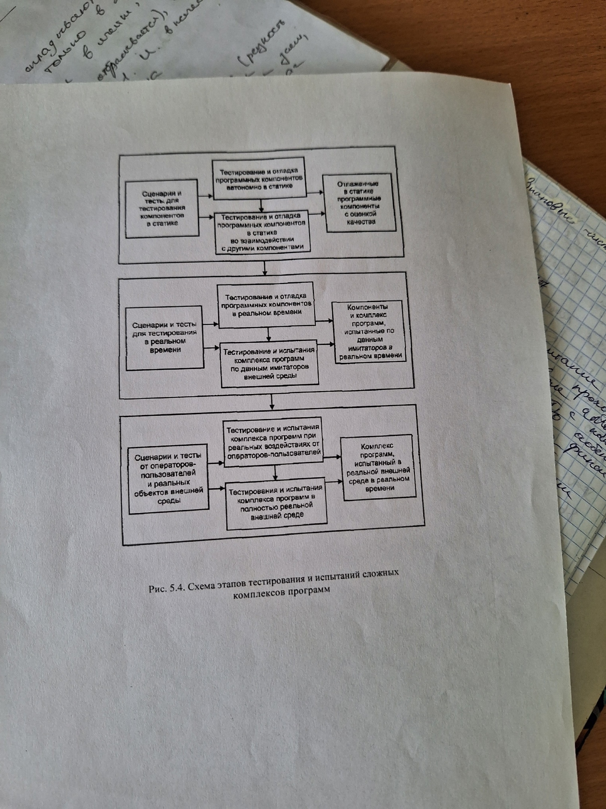

# Организация и этапы тестирования при испытаниях надежности сложных ПО

Основные этапы тестирования и испытаний комплекса ПО и его компонентов представлены на рисунке:

Для каждого этапа на рисунке представлены основные исходные данные и результаты тестирования и испытаний выделены следующие испытания:

1) Комплектирование модулей и отладка автономных групп программ в статике без взаимодействия с другими компонентами и возможно без подключения к ОС реального времени.
2) Тестирование и отладка групп программ в статике с учетом взаимодействия с некоторыми другими важнейшими компонентами и с БД.
3) Тестирование и отладка отдельных программных компонентов в реальном времени во взаимодействии с другими функциональными компонентами и с основными компонентами ОС и БД.

Сложность тестирования компонентов на этих этапах обусловлена несинхронным процессом их разработки и отладки. В результате комплексного тестирования ПО могут быть готовы не все компоненты. После комплектирования основных функциональных компонентов начинаются тестирование испытания ПО в целом. Для них характерны следующие стадии комплексного тестирования и испытания ПО в реальном времени:

1) Под данным моделируемого стенда или генератором тестов, имитирующих объектов реальной среды.
2) С имитаторами отдельных объектов внешней среды и с реальными воздействиями от операторов пользователей.
3) В полностью адекватной реальной или имитированной внешней среде и с реальными воздействиями от операторов пользователей.

На всех стадиях отладки можно выделить еще 2 важные группы работ:

1) Работы по методическому обеспечению тестирования и при создании средств. автоматизированной генерации тестов.
2) Она должна обеспечивать возможность обработки результатов тестирования и оценки достигнутых показателей качества функционирования ПО.

Каждая стадия тестирования должна иметь фиксированный и документированный результат с достигнутыми характеристиками ПО.

## Организация завершающих испытания комплекса ПО

1) Испытания главного конструктора, которые зачастую совмещаются с завершением комплексной отладки должны, должны оформляться документально и являются основанием для предъявления ПО заказчику на завершающие совместные испытания. Для повышения достоверности определения и улучшения характеристик ПО после испытаний главного конструктора ПО целесообразно передавать некоторым пользователям на опытную эксплуатацию в типовых условиях.
2) Совместные приемо-сдаточные испытания проводятся комиссией заказчика, в которой участвует главный конструктор разработки, некоторые ведущие разработчики, но чаще всего выбирают тех, у кого есть аттестационные сертификаты.
3) Комиссия при испытании руководствуется следующими документами:
    1. Утвержденным заказчиков и согласованным с разработчиком ТЗ и спецификациями ПО.
    2. Действующими государственными и ведомственными стандартными на проектирование и испытания ПО и на техническую документацию, а также согласованными с заказчиком стандартами.
    3. Программы испытаний по всем требования ТЗ.
    4. Методиками испытаний по каждому разделу требований ТЗ.
    5. Комплектом эскплуатационной документации на ПО.

Программа испытаний должна содержать следующие четко сформулированные разделы:

1) Объект испытаний, его назначение и перечень основных документов, определивших его разработку.
2) Цель испытаний с указанием всех требований ТЗ, подлежащей проверке и ограничении на проведение испытаний.
3) Собственную программу испытаний, содержащую проверку комплектности спроектированного ПО в соотвествии с ТЗ и план тестирования для проверки по всем разделам ТЗ.
4) Методики испытаний однозначной определяющие все понятия, проверяемых характеристик, условия и сценарии тестирования и средства, используемые для испытаний.
5) Методики обработки и оценки результатов тестирования о каждому разделу программы испытаний.

Результаты испытаний фиксируются в протоколах, содержащих следующие разделы:

1) Назначение тестирования и раздел требований ТЗ, по которому проводились испытания.
2) Указание методик в соответствии с которыми проводились испытания обработка и оценка результатов.
3) условия и сценарии проведения тестирования и характеристики исходных данных.
4) Обобщенные результаты испытаний с оценкой их на соответствие требований ТЗ, а также технической документации.
5) Выводы о результатах испытаний и соответствие созданного ПО определенному разделу требований ТЗ.

Протоколы по всей программе испытаний обобщаются в акте, в результате чего делается заключение о соответствии системы требованиям заказчика и завершения работы с положительным или отрицательным итогом.

При полном выполнении всех требований ТЗ заказчик обязан принять систему ПО и работа считается завершенной.
