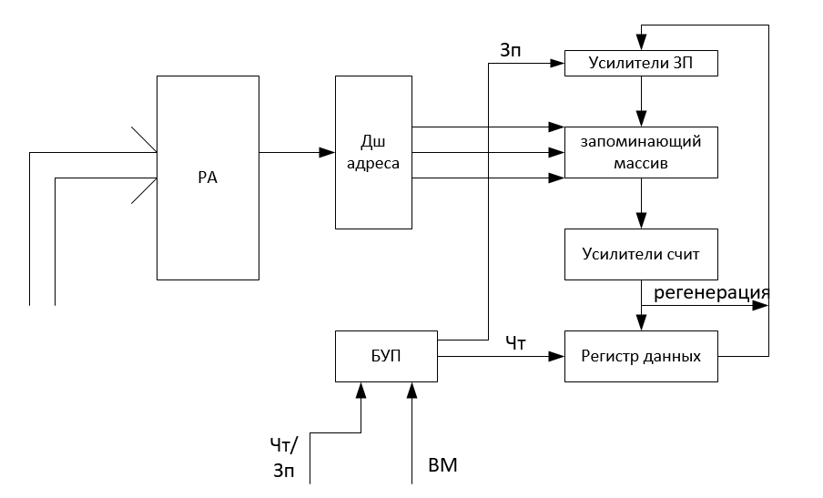

# Структура микросхемы RAM

ПЗУ обеспечивает считывание информации, но не допускает её изменения.

Каждая ячейка содержит фиксированное число запоминающих элементов и имеет уникальный адрес.

Адрес принадлежит байту.

DRAM - динамический RAM

EDO DRAM - основной тип памяти Pentium

SDRAM - синхронная DRAM

SDRAM PC100 - 100 МГц 8нс

# Накопители на компакт-дисках

Запись производится прожиганием на подложке миниатюрных штрихов-питов.

- CD-ROM - только для чтения.
- CD-R - для однократной записи
- CD-RW - для многократной записи

У перезаписываемых дисков регистрирующий слой выполнен из органических соединений, известных под названием цианин и фталоцианин. Они могут изменять состояние от аморфного на кристаллическое под лучом лазера

- DVD-ROM - только для чтения
- DVD-R - для однократной записи
- DVD-RW - для многократной записи
- DVD-5 - односторонний однослойный 4,7 Гбайт
- DVD-9 - односторонний двуслойный 8,5 Гбайт
- DVD-10 - двусторонний однослойный 9,4 Гбайт
- DVD-18 - двусторонний двуслойный 17 Гбайт

Длина волны:

- CD = 780 нм
- DVD = 650 нм
- BD = 405 нм

Дисковод:

- загрузочное устройство
- оптико-механический блок
- системы управления приводом и автоматическое регулирование
- универсальный декодер и интерфейсный блок

Универсальный декодер это специальный процессор для обработки считанной информации. Позволяет восстановить потерянную информацию объёмом до 500 байт.

Интерфейсный блок состоит из ЦАП (цифроаналоговый преобразователь), фильтр нижних частот, интерфейс связи с компьютером

Характеристики:

- качество считывания характеризуется коэффициентом ошибок - вероятность искажённого информационного бита. Значение коэффициента = 1-10^-10 / 1\*10^-12
- среднее время доступа (в мс) требуется приводу, чтобы найти нужные данные. При 60х скорости среднее время доступа 15 мс

# Blu-ray

- BD-ROM
- BD-R
- BD-RE

диаметр 120мм.
