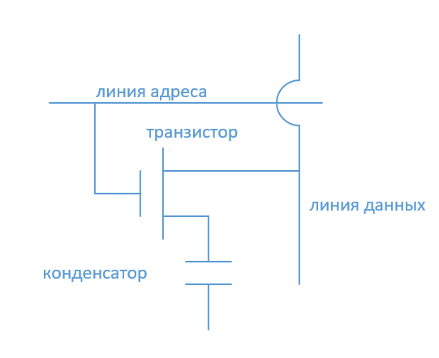

# Реферат

1. Титульный лист
2. Шрифт 14 TNR, межстрочный интервал 1,5см
3. Выравнивание по ширине
4. Объём 10 стр.
5. Список литературы 5 источников

# Оперативная память

ОЗУ - динамическая память RAM (random access memory). Память энергозависимая.

Характеристики:

- объём
- разрядность
- быстродействие
- временная диаграмма (циклограмма)

Общий объём микросхемы памяти определяется произведением глубины адресного пространства на количество линий ввода/вывода. Глубиной адресного пространства называется количество бит, хранящихся в ячейках памяти.

Разрядность микросхемы определяется числом линий ввода/вывода.

Быстродействие определяется суммой времени последовательного выполнения действий между двумя операциями чтения или записи - рабочим циклом.

Рабочий цикл:

1. Выбор строки (RAS)
2. Выбор столбца (CAS)
3. Чтение или запись

Временная диаграмма характеризует число тактов, необходимых для выполнения 4 последовательных операций считывания данных.

