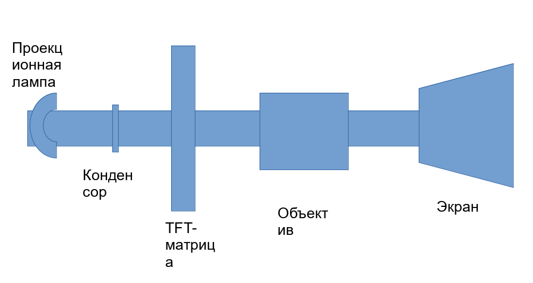

# Накопители на магнитной ленте

Достоинства:

- низкая стоимость хранения данных

  1 Гбайт на жёстком диске стоит 0,025$, на магнитной ленте - 0,008$.

- долговечность

  При записи на магнитную ленту ошибки возникают на 4 порядка меньше. Может служить около 30 лет.

Стример - устройство записи на магнитную ленту.

# Видеокарта

Видеокарта - устройство, преобразующее графический образ, хранящийся в памяти компьютера, в форму, пригодную для вывода на экран монитора.

Устройство:

- графический процессор - расчёт данных выводимого изображения. Обрабатывает команды трёхмерной графики
- видеоконтролер - обеспечивает образование изображения в видеопамяти
- буфер для хранения изображений, генерируемых и изменяемых графическим процессором
- цифро-аналоговый преобразователь (ЦАП)
- видео-ПЗУ - хранит BIOS
- система охлаждения

## Характеристики видеокарты

- производители и модель графического процессора
- производитель видеокарт
- объем и частота видеопамяти
- разрядность шины памяти

дискретные и интегрированные 

2D и 3D акселераторы

2D акселератор - графический ускоритель для обработки двумерной графики

Аппаратное ускорение графических примитивов

масштабирование окон

Две группы:
- видеоадаптеры с графическим ускорителем
- с графическим сопроцессором

3D акселераторы для обеспечения возможности видеть 3D-объекты

Первый проектор изобрёл немецкиЙ физик Керхер в 1646 году.

Компьютерные проекторы делим на две группы:

1. Универсальные (оверхед-проекторы) общего назначения

  В качестве источника изображения используется внешний модулятор (ЖК-панель)

2. Мультимедийные проекторы со встроенным модулятором

  Изображение проецируется с помощью специального проецируемого зеркала

  Делятся они на отражательные и просветлённые

  Отражательные проекторы - это малогабаритные устройства для изображений, нанесённых на специальную прозрачную плёнку

  Просветлённые - проекционная лампа размещается под рабочей поверхностью. Мощность лампы увеличена в несколько десятков раз.
  Источник изображения - ЖК-панель, подключенная к ПК.

  ЖК-панель напоминает дисплей ПК.

Характеристики ЖК-панели:
- размер
- максимальное разрешение
- количество воспроизводимых цветов
- яркость

Всё в одном корпусе

Модуляторы проектора бывают следующего типа:
- TFT-проекторы
- Полисиликоновые проекторы
- DMD/DLP-проекторы

В полусиликоновых проекторах просветлённого типа применяются три монохромные ЖК-матрицы размером 1,3" и они формируют изображение красного синего и зелёного цвета. Оптическая система совмещает три монохромных изображения.

Каждый элемент такой матрицы содержит только один тонкоплёночный транзистор, поэтому его размер меньше. В проекторах отражательного типа используется технология DMD/DLP. Изображение отражается от матрицы, состоящей из электрических управляемых микрозеркал (до миллиона микрозеркал)

Характеристики видеопроектора:
- световой поток - от 1000 до 2000лм
- полусреднее значение измерений освещённости
- контрастность - измеряется при проецировании 16 клеточное шахматное поле и вычисляется в виде отношения освещённости в центрах белых и чёрных прямоугольников (250:1 -> 500:1)
- равномерность - отношение минимальной освещённости в контрольных точках к максимальной
- источник света - галогенные лампы используются в проекторах небольшой мощности (срок службы 50-100 часов). Металлогаллоидные - для проекторов средней и высокой мощности (срок службы 1000-2000 часов). Ксеноновые лампы - используются в наиболее мощных проекторах.
