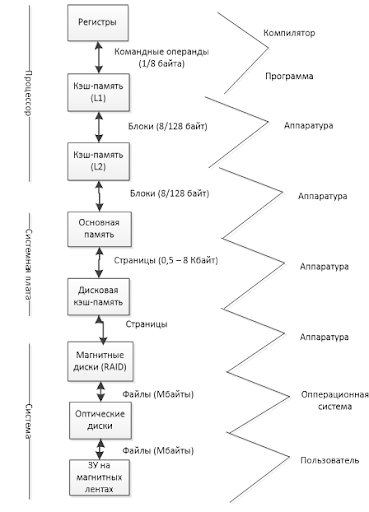
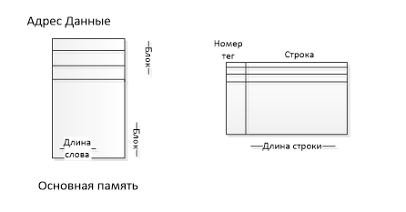

# Память

## Иерархия запоминающих устройств

Характеристики запоминающих устройств:

- Расположение, место (процессорные, внутренние, внешние)
- Ёмкость ЗУ – определяет максимально количество информации, которое может в ней храниться
- Единица пересылки
- Метод доступа
    1. Последовательный доступ, для доступа к нужному элементу необходимо прочитать все предшествующие варианты. Время доступа зависит от положения последовательности записей. Пример: ЗУ на магнитной ленте
    2. Прямой доступ. Каждая запись имеет уникальный адрес. Обращение идёт как адресный доступ к началу записи. Время доступа – переменная величина. Пример: магнитные и оптические диски.
    3. Произвольный доступ. Каждая ячейка память имеет уникальный адрес. Время обращения одно и то же. Пример: ОЗУ.
    4. Ассоциативный доступ. Позволяет выполнить поиск ячеек по совпадению отдельным бит, с заданным образцом. Сравнение идет для всех ячеек памяти параллельно. Пример: кэш-память.
- Быстродействие. Определяется временем доступа (Тд), длительностью цикла памяти или периодом обращения (Тц), скоростью передачи (TN – среднее время считывания, TA – среднее время доступа, R – время пересылки; )
- Физический тип ЗУ
- Физические особенности (энергозависимость)
- Стоимость. Оценивается отношение общей стоимости ЗУ к его емкости в битах

## Кэш-память

### Структура системы с основной кэш-памятью

На эффективность кэш-памяти влияет:
- Емкость кэш памяти
- Размер строки
- Способ отображения основной памяти в кэш
- Алгоритм замещения информации в заполненной кэш-памяти
- Алгоритм согласования содержимого основной и кэш-памяти
- Число уровней кэш-памяти

Способы отображения:
- Прямое отображение. Адрес строки кэш-памяти однозначно закреплен за определенными блоками. I = j modm.
- Полностью ассоциативное отображение. Позволят загрузку любого блока ОП в любую строку кэш-памяти.
- Множественно-ассоциативное отображение.
